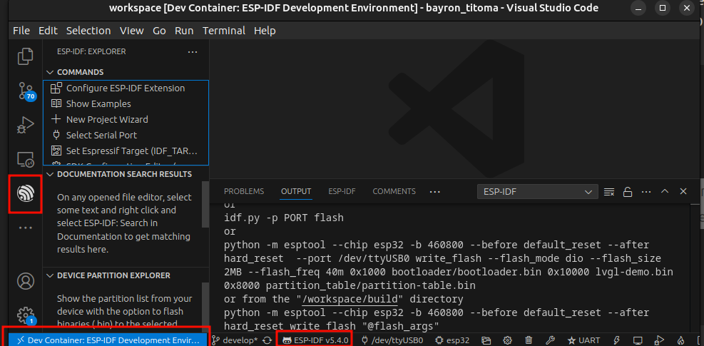
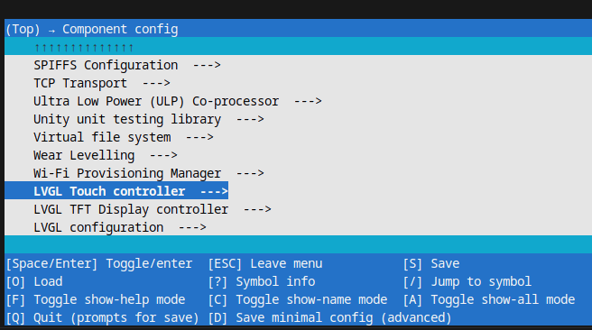

Here's a detailed README for your project:

---

# Clock Alarm Application with Touch Panel and LCD (480x320) on ESP-IDF v5.4.0

## Overview

This project is a Clock Alarm Application designed for ESP32, featuring touch panel support and a ILI9488 480x320 LCD display. It is built using the ESP-IDF v5.4.0 framework and integrates LVGL (Light and Versatile Graphics Library) for GUI rendering. The project setup includes a Docker container with Visual Studio Code and necessary extensions for seamless development.

## Example Video and Images

Watch Video : 

   [](https://www.youtube.com/watch?v=msy5F0tQy0Q&ab_channel=BayronCabrera)

Reference Image: 

   


## Features

- **Clock Alarm Application**: Displays time and allows setting alarms.
- **Touch Panel Support**: Interact with the application through a touch screen.
- **ILI 9488 480x320 LCD Display**: High-resolution display for clear and detailed visuals.
- **ESP-IDF Integration**: Built using ESP-IDF v5.4.0 for robust and efficient performance.
- **LVGL Integration**: Utilizes LVGL 8.3 for advanced graphics rendering.
- **Dockerized Development Environment**: Includes a Docker container with pre-installed VSCode extensions for ESP-IDF development.

## Project Structure

```
.
├── build
├── components
│   ├── lvgl
│   └── lvgl_esp32_drivers
├── documentation
├── main
│   ├── lvgl_app
│   └── main.c
├── LICENSE
├── Makefile
├── README.md
└── sdkconfig
```

## HW Configuration : 
Here is a detailed hardware connection table for connecting the ESP32 to the ILI9488 display:

### Hardware Connections

| **ESP32 GPIO Pin** | **ILI9488 Pin**     | **Function**           |
|--------------------|---------------------|------------------------|
| 5.0V               | VCC                 | Power Supply           |
| GND                | GND                 | Ground                 |
| GPIO15             | CS                  | Chip Select            |
| GPIO4              | RESET               | Reset                  |
| GPIO2              | DC/RS               | Data/Command Select    |
| GPIO13             | SDI (MOSI), T_DIN   | Serial Data In (MOSI)  |
| GPIO14             | SCK                 | Serial Clock           |
| 3.3V               | LED                 | Backlight Control      |
| GPIO5              | T_CS                | Touch Chip Select      |
| GPIO19             | T_DO                | Touch Data Out (MISO)  |
| GPIO23             | T_DI                | Touch Data In (MOSI)   |
| GPIO25             | T_IRQ               | Touch Interrupt        |
| GPIO18             | T_CLK               | Serial Clock           |


### Notes
- Ensure that all connections are secure and that there are no loose wires.
- Double-check the pin numbers on both the ESP32 and the ILI9488 to ensure correct wiring.
- If using a breadboard, make sure it is properly powered and that all connections are made through the correct rails.

By following these connections, you should be able to interface the ESP32 with the ILI9488 display successfully, enabling the display and touch functionalities for your project.

## Prerequisites

- **Docker**: Ensure Docker is installed and running on your system.
- **Visual Studio Code**: Recommended for development and debugging.

## Setup Instructions

1. **Clone the Repository**:
   ```sh
   git clone git@github.com:bdcabreran/ESP32-IDF-LVGL.git
   cd <repository-directory>
   ```

2. **Open Project Folder on vscode**:
   ```sh
   cd <repository-directory>
   code .
   ```
- Once this repository is on your local PC, open it using Visual Studio Code and press `Ctrl+P`. Select the option `Dev Containers: Open in container`.

- This will start creating the Linux Docker image. Once it is completed, you can then press `Ctrl+P` and select `Create New Terminal`. You will now be inside the Docker container, and the environment is ready to start working.

3. **Example of Container**: 

   Once inside the container, you should be able to see the ESP-IDF extension along with a `Dev Container: ESP-IDF Development Environment` tag in the bottom left corner.
   


## Configurations

### Supported LCDs

Below a Table of supported LCDs: 

Here's a table listing the supported LCDs and touch panels based on the provided directory structure:

### Supported LCDs and Touch Panels

| **Category** | **Name**       | **File**                   |
|--------------|----------------|----------------------------|
| **LCDs**     | ILI9341        | `lvgl_tft/ili9341.c`       |
|              | ILI9481        | `lvgl_tft/ili9481.c`       |
|              | ILI9486        | `lvgl_tft/ili9486.c`       |
|              | ILI9488        | `lvgl_tft/ili9488.c`       |
|              | HX8357         | `lvgl_tft/hx8357.c`        |
|              | ST7735S        | `lvgl_tft/st7735s.c`       |
|              | ST7789         | `lvgl_tft/st7789.c`        |
|              | GC9A01         | `lvgl_tft/GC9A01.c`        |
|              | SSD1306        | `lvgl_tft/ssd1306.c`       |
|              | SH1107         | `lvgl_tft/sh1107.c`        |
|              | RA8875         | `lvgl_tft/ra8875.c`        |
|              | IL3820         | `lvgl_tft/il3820.c`        |
|              | FT81x          | `lvgl_tft/FT81x.c`         |
|              | EVE            | `lvgl_tft/EVE_commands.c`  |
| **Touch Panels** | XPT2046        | `lvgl_touch/xpt2046.c`      |
|              | FT6X36         | `lvgl_touch/ft6x36.c`      |
|              | STMPE610       | `lvgl_touch/stmpe610.c`    |
|              | RA8875 Touch   | `lvgl_touch/ra8875_touch.c`|
|              | ADC Raw        | `lvgl_touch/adcraw.c`      |
|              | FT81x Touch    | `lvgl_touch/FT81x.c`       |

### Description

- **LCDs**: These are the supported display controllers. Each entry in the table corresponds to an LCD driver implemented in the specified source file.
- **Touch Panels**: These are the supported touch controllers. Each entry in the table corresponds to a touch panel driver implemented in the specified source file.

### LCD & Touch Configuration via `menuconfig`

To configure these LCDs and touch panels, use the `menuconfig` tool in ESP-IDF:
1. Run `idf.py menuconfig`.
2. Navigate to `Component config -> LVGL Touch controller`.
3. Configure your specific touch panel under `Touchpanel Configuration`.
4. Similarly, navigate to `Component config -> LVGL TFT Display controller` to configure your specific LCD.

### LVGL Configuration via `menuconfig`
To configure LVGL settings, use the `menuconfig` tool in ESP-IDF:

1. Run `idf.py menuconfig`.
2. Navigate to `Component config -> LVGL Configuration`.
3. Configure your specific LVGL settings such as buffer sizes, color depth, and performance options.
4. Alternatively the user can check the available options via `lvgl_config.h` file under `lvgl` component


Reference:
* 


## Usage

1. **Build the Project**:
   ```sh
   idf.py build
   ```

2. **Flash the Project**:
   ```sh
   idf.py flash
   ```

3. **Monitor the Output**:
   ```sh
   idf.py monitor
   ```


## License

This project is licensed under the MIT License. See the [LICENSE](LICENSE) file for more details.

## Author

**Bayron Cabrera**

- **GitHub:** https://github.com/bdcabreran
- **LinkedIn:** https://www.linkedin.com/in/bayron-cabrera-517821124/
- **Email:** bayron.nanez@gmail.com

For Further information check esp32_port example : 
* https://github.com/lvgl/lv_port_esp32
* https://github.com/Mair/learn-lvgl/tree/master/esp32